# 🔷 Blue Matrix

**Blue Matrix** is a comprehensive **Project Management Dashboard** built with cutting-edge full-stack technologies and AWS services. The frontend is developed using **Next.js**, **Tailwind CSS**, and **Material UI Data Grid** to deliver a responsive and dynamic user experience. State management and data fetching are handled efficiently using **Redux Toolkit** and **RTK Query**.

The backend leverages **Node.js**, **Express**, and **PostgreSQL**, with **Prisma ORM** ensuring seamless database interaction and **PgAdmin** for database monitoring. The application is cloud-ready, integrating **AWS Lambda** for scalable serverless functions and **AWS Cognito** for secure and reliable user authentication.

---

## 📸 Screenshots

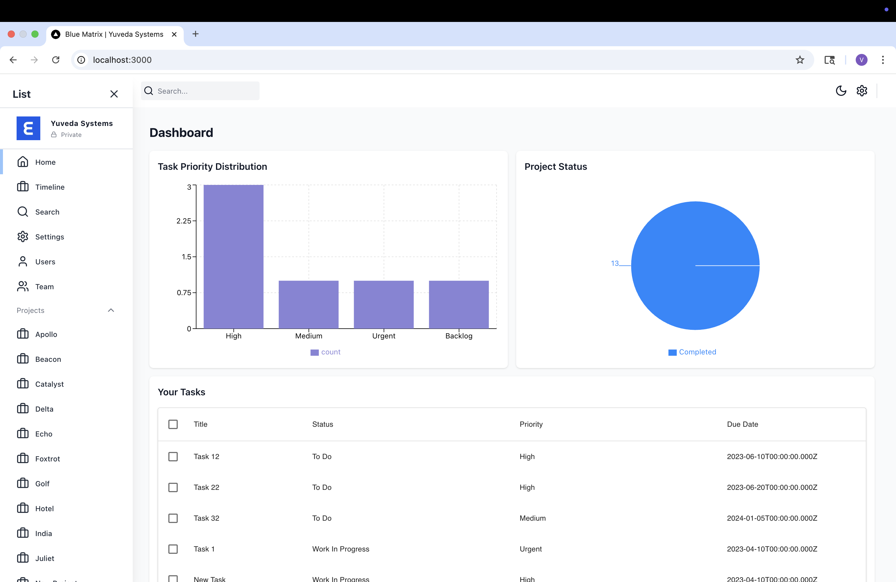
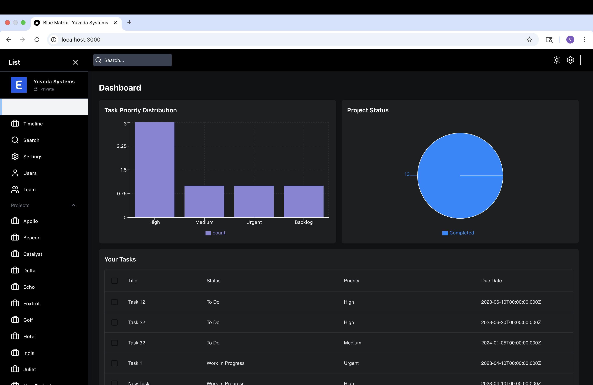
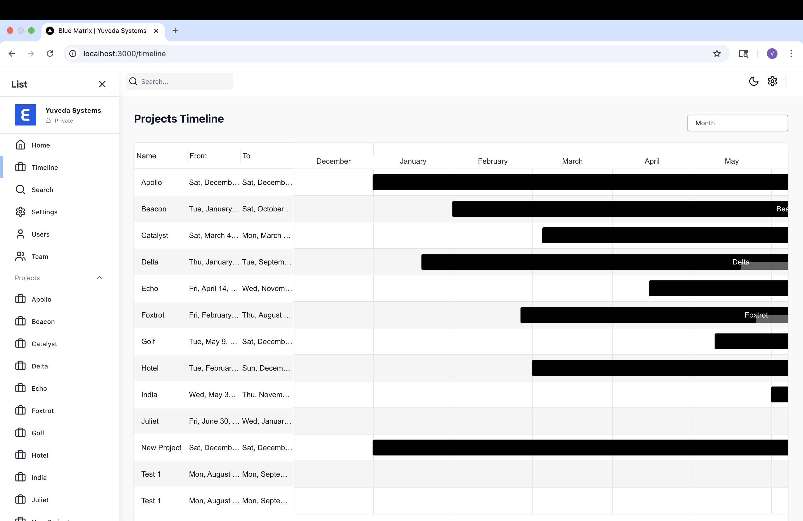
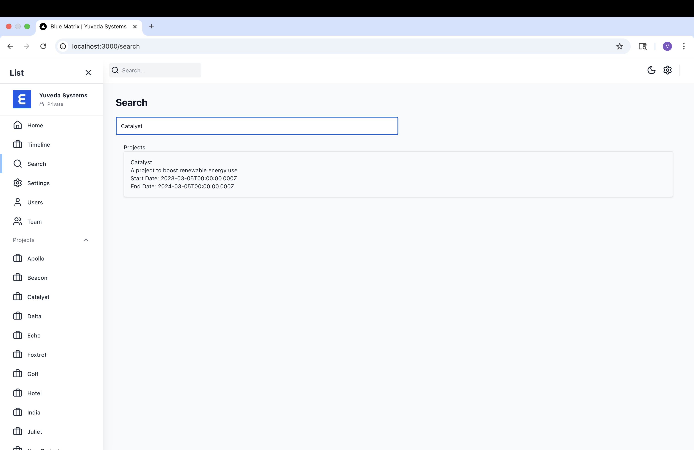
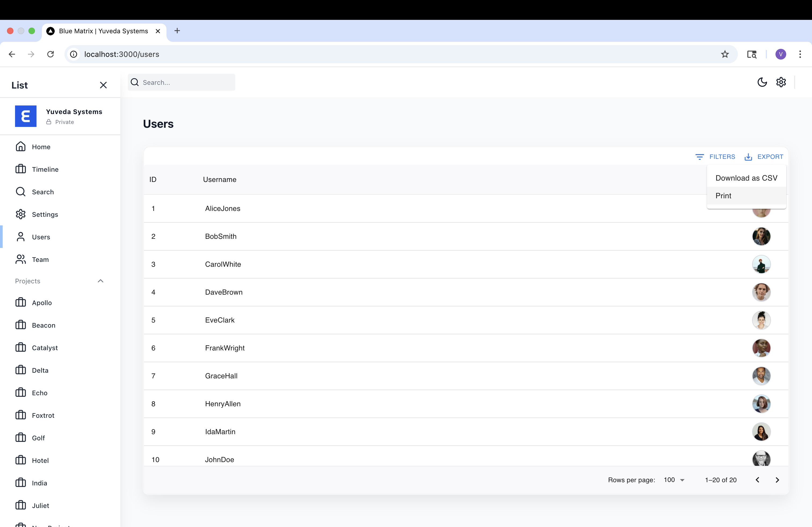
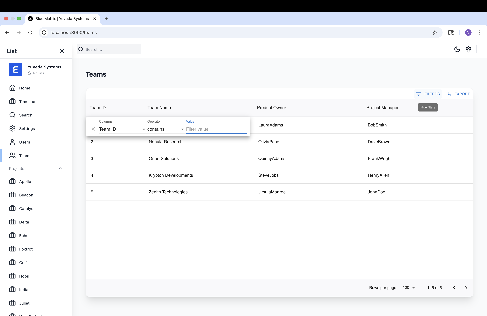
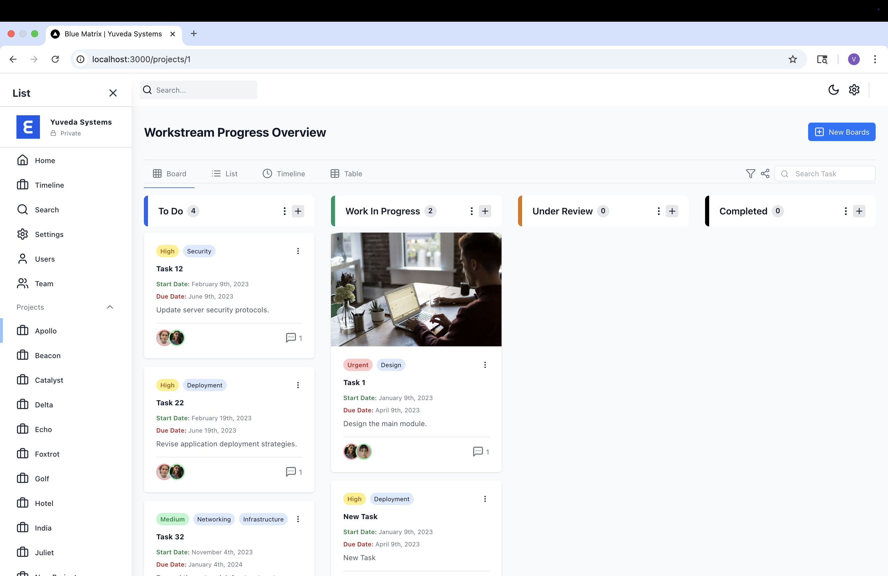
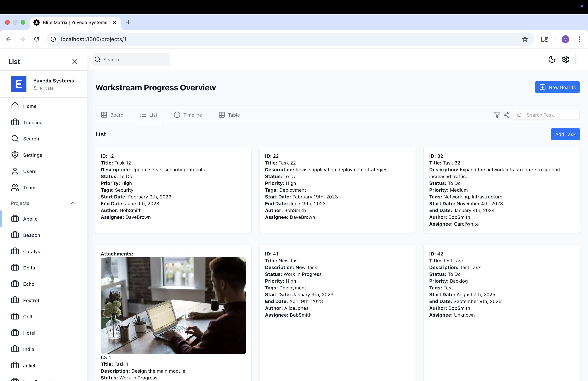
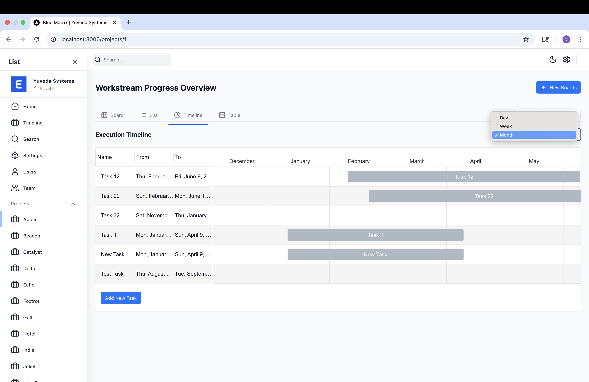
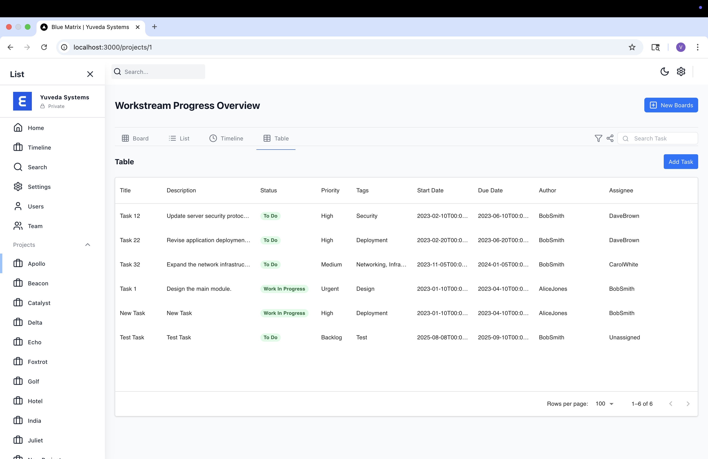
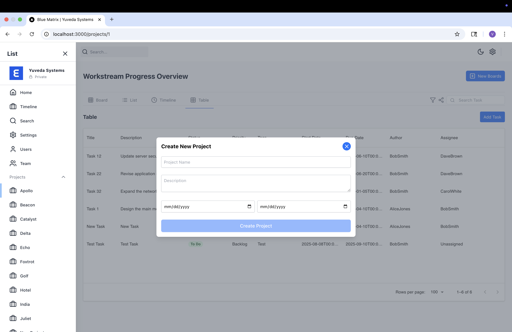
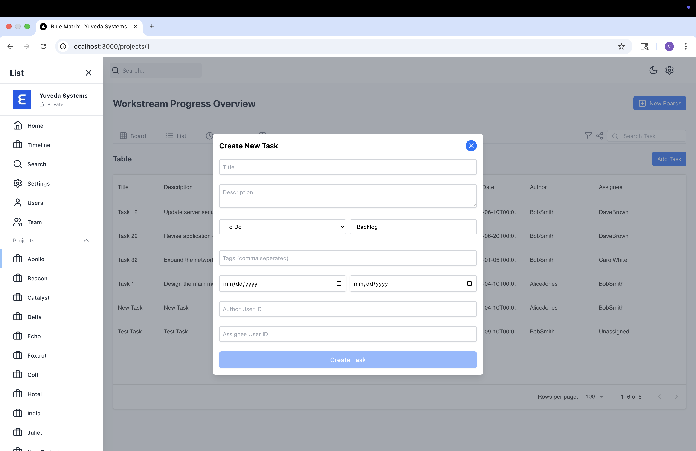
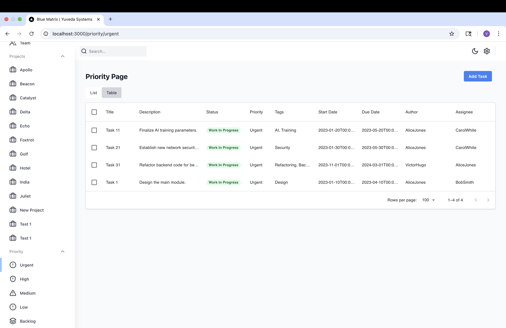
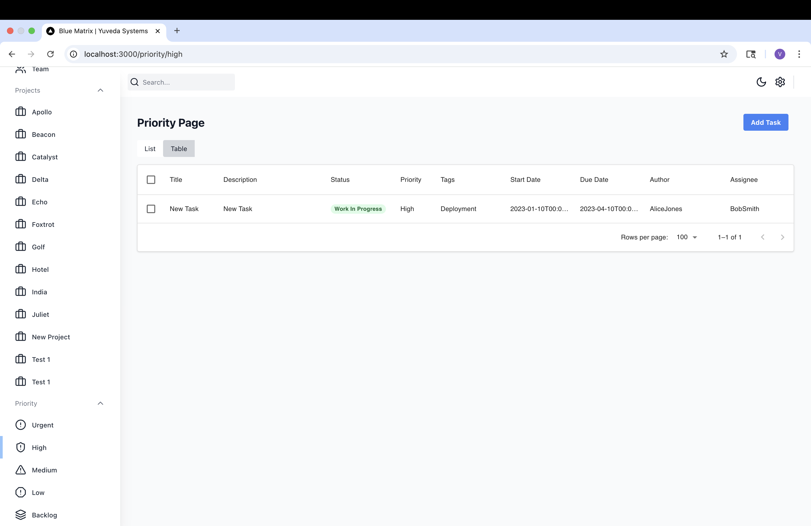

---

